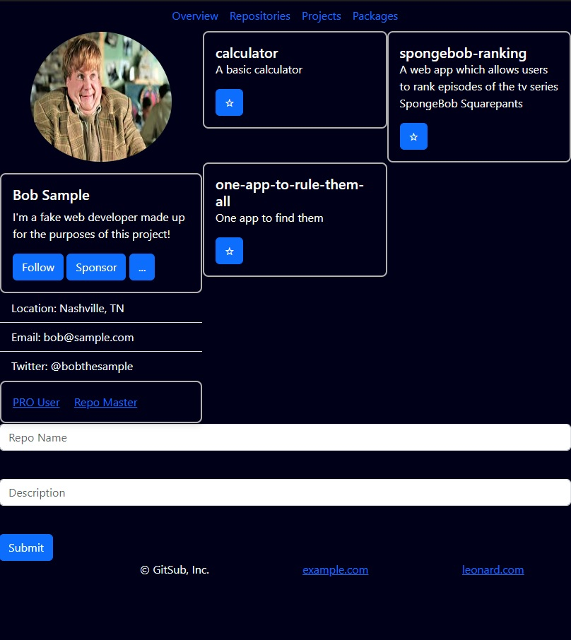

# GITSUB 

[Check out our app!](https://guinea-pig-squad.netlify.app/index.html)

## About the User
- The ideal user would be a software developer
- They would like a place to keep track of repositories, projects, and packages

## Features
- This app features four main pages:
- An overview page, which will allow the user to add a repository and view repositories that they have pinned. Repositories added via the form on this page will be pinned by default.
- A repositories page, which will show the user a list of ALL repositories in addition to a list of tags for each one. Repositories can also be added via a form on this page that will be unpinned.
- A projects page, which will allow the user to view a list of their projects and add new ones.
- A packages page, which will allow the user to view a list of their packages and add new ones.

# Flowchart
  https://www.figma.com/board/hrHj01adjaTGn9ntppSqCG/Untitled?node-id=0-1&t=bFoPYgCmjOcNNOiR-1

# ERD
 https://dbdiagram.io/d/guinepigsquad-gitsub-67218a5eb4216d5a28a9bf75

# Wireframe
  https://www.figma.com/design/8vIX1yEXd2UxdWARbWqAje/GitSub?node-id=0-3&t=fX3FW5jL14liosHb-1

# Project Screenshot

# Video Walkthrough
  https://www.loom.com/share/d634ebe4be9d4d699133c7dcf33adb79?sid=ff0e0d90-87b0-4495-92f6-ed10bedf5f1e

## Relevant links
- [Project Board](https://github.com/orgs/nss-evening-cohort-29/projects/8/views/1)

# Contributors
- [Mike McGee](https://github.com/mikemcgee92)
- [Tyler Davenport](https://github.com/Tyler-Davenport)
- [Leonard Robinson](https://github.com/leonardrobinson)
